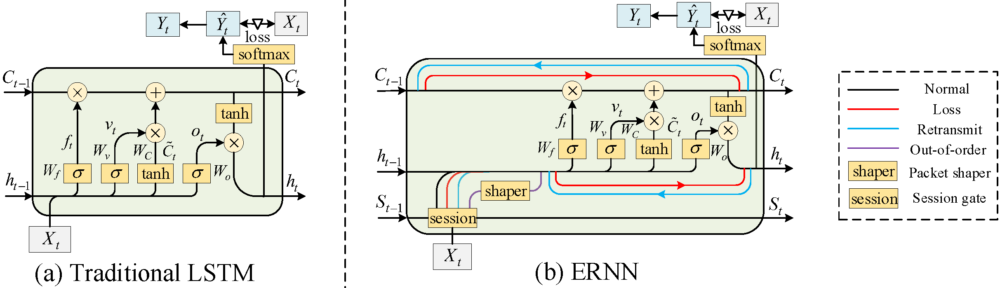

# TDSC_ERNN



**ERNN: Error-Resilient RNN for Encrypted Traffic Detection towards Network-Induced Phenomena**

ERNN is a robust and end-to-end RNN model designed specifically for cybersecurity detection systems (IDS and Malware) to alleviate misclassifications introduced by network-induced phenomena, such as packet loss, retransmission, and out-of-order.

## Network-Induced Phenomena
We consider three main network-induced phenomena.

(i)    Packet loss: It refers to the server-side lost some packets sent from the client-side.

(ii)   Retransmission: It refers to the client repeatedly sending a series of packets for the integrity of the transmission.

(iii)  Out-of-order: It means that the packet received by the server is not in the same sequence as the one sent by the client.

## Running

The model architecture is stored in ./code/ernn.py. 

```bash
python ernn.py
```
The ./code/model-base shows some Baseline model profiles.

The ./code/model-ernn shows some ERNN model profiles.

## Publications

### References
- [Optimized Invariant Representation of Network Traffic for Detecting Unseen Malware Variants](https://www.usenix.org/conference/usenixsecurity16/technical-sessions/presentation/bartos), Karel Bartos, Michal Sofka, and Vojtech Franc - USENIX Security 2016
- [Kitsune: An Ensemble of Autoencoders for Online Network Intrusion Detection](https://arxiv.org/abs/1802.09089), Yisroel Mirsky, Tomer Doitshman, Yuval Elovici, and Asaf Shabtai - NDSS 2018
- [FS-Net: A Flow Sequence Network For Encrypted Traffic Classification](https://ieeexplore.ieee.org/document/8737507), Chang Liu, Longtao He, Gang Xiong, Zigang Cao, and Zhen Li - INFOCOM 2019
- [Combining supervised and unsupervised learning for zero-day malware detection](https://ieeexplore.ieee.org/document/6567003), Prakash Mandayam Comar, Lei Liu, Sabyasachi Saha, Pang-Ning Tan, and Antonio Nucci - INFOCOM 2013
- [MaMPF: Encrypted Traffic Classification Based on Multi-Attribute Markov Probability Fingerprints](https://ieeexplore.ieee.org/document/8624124), Chang Liu, Zigang Cao, Gang Xiong, Gaopeng Gou, Siu-Ming Yiu, and Longtao He - IWQoS 2018
